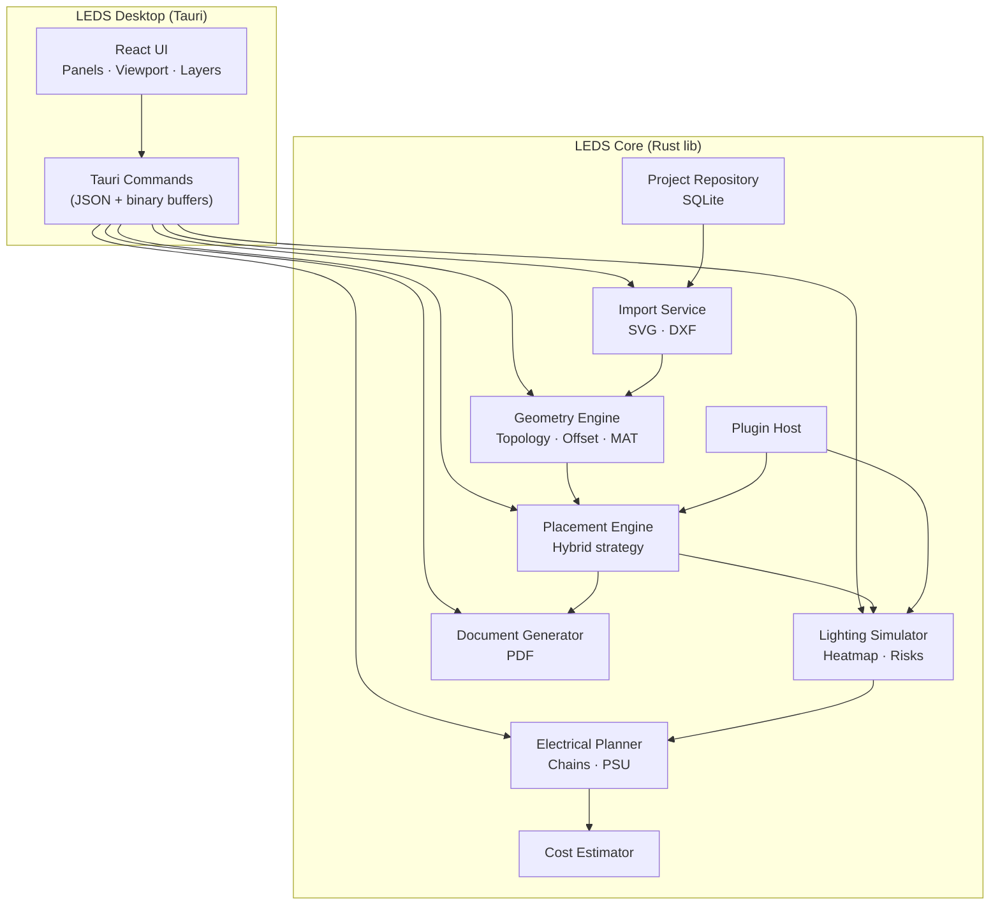

# Архитектура системы LEDS

## 1. Архитектурные принципы

1. **Разделение ядра и UI** — вся геометрия, размещение и светотехника в нативном ядре (Rust); UI — тонкий клиент.
2. **Deterministic core** — одинаковый вход → одинаковый выход (важно для производства и споров с клиентом).
3. **Plugin boundary** — новые типы модулей без пересборки ядра (manifest + опциональный WASM).
4. **Offline-first** — SQLite + файловые проекты; сеть только для лицензий/обновлений.
5. **Тестируемость** — ядро как библиотека + CLI для регрессионных тестов на эталонных SVG.

---

## 2. Стек технологий

| Слой | Технология | Обоснование |
|------|------------|-------------|
| **Geometry Core** | Rust, `geo`, `clipper2`, `kurbo`, custom MAT | Скорость, безопасность памяти, кросс-компиляция |
| **Placement & Light** | Rust (rayon параллелизм) | CPU-intensive, без GC-пауз |
| **Desktop shell** | **Tauri 2** | Современный UI, малый инсталлятор, доступ к ФС |
| **Frontend** | React 19 + TypeScript | Экосистема, CAD-панели, состояние |
| **Canvas / Viewport** | **PixiJS 8** или WebGL2 custom | Плавный pan/zoom, тысячи объектов |
| **State** | Zustand + Immer | Предсказуемый UI state |
| **Local DB** | SQLite (rusqlite в core, sql.js опционально в UI) | Проекты, история, справочники |
| **Documents** | typst или printpdf (Rust) + шаблоны | Качественный PDF без headless Chrome |
| **DXF** | `dxf` crate + собственный нормализатор | Парсинг; SPLINE — аппроксимация |
| **SVG** | `usvg` / `resvg` pipeline | Стандарт de-facto из Corel |
| **Plugin runtime** | WASM (wasmtime) Phase 2 | Изоляция пользовательских модулей |
| **Updates** | HTTPS + signed manifest (ed25519) | Справочники модулей |
| **CI** | GitHub Actions, cargo test, playwright (UI smoke) | |

**Альтернатива (не выбрана для v1):** Qt/C++ — выше стоимость UI-разработки; Electron — тяжёлый runtime.

---

## 3. Высокоуровневая схема (C4 — Container)



---

## 4. Модули ядра (детализация)

### 4.1 Import Service

- Парсинг SVG/DXF → нормализованные сегменты (line, arc, cubic bezier).
- Тесселяция кривых с допуском ε мм.
- Сборка замкнутых ring'ов, определение winding (outer CCW / holes CW).
- Привязка к слоям исходного файла.

### 4.2 Geometry Engine

- **Planar graph** контуров с вложенностью (even-odd rule).
- **Polygon offset** (Clipper2) — борт, безопасная зона.
- **Distance transform** на растеризованной маске (Felzenszwalb 1D/2D).
- **Medial axis** — Voronoi диаграмма сегментов границы или thinning на маске.
- **Skeleton graph** — ветвления для размещения вдоль «хребта» буквы.
- **Feature detection** — тонкие штрихи (ширина < 2×шаг), острые углы (< 45°).

### 4.3 Placement Engine

См. [08_ALGORITHMS_PLACEMENT.md](./08_ALGORITHMS_PLACEMENT.md).

Вход: допустимая зона, граф скелета, каталог модуля.  
Выход: список позиций (x, y, θ), метрики качества.

Режимы:
- `Auto` — полный pipeline.
- `SemiAuto` — авто + respect `fixed` flags + local repair.
- `Expert` — только валидация и пересчёт света.

### 4.4 Lighting Simulator

См. [09_ALGORITHMS_LIGHTING.md](./09_ALGORITHMS_LIGHTING.md).

- Суперпозиция ядер Гаусса / cos^n(θ) с учётом глубины.
- GPU optional: compute shader для больших полей.

### 4.5 Electrical Planner

- Группировка модулей в цепочки (напряжение, ток, длина провода).
- Bin-packing PSU из справочника.
- Предупреждения: перегруз, неравномерность цепей.

### 4.6 Document Generator

- Шаблоны Typst/Mustache → PDF.
- Вложения: план монтажа (PNG/SVG), таблица спецификации.

### 4.7 Plugin Host

- Manifest: `id`, `geometryBounds`, `lightModel`, `constraints`.
- v1: JSON + встроенные типы; v2: WASM callback `computeSpot`.

---

## 5. Frontend architecture

```
src/
├── app/           # routes, layout shell
├── viewport/      # PixiJS stage, camera, selection
├── panels/        # properties, layers, library, errors, heatmap
├── commands/      # undo stack, invoke tauri
├── stores/        # project, selection, tools
└── i18n/
```

**Паттерн:** Command pattern для undo; события ядра → patch store.

**Viewport layers (z-order):**
1. Grid / guides  
2. Imported geometry  
3. Safe zone (optional debug)  
4. Medial axis (debug)  
5. Module sprites  
6. Heatmap overlay (blend multiply)  
7. Selection handles  

---

## 6. Backend (опциональный сервер — Phase 3)

Не обязателен для v1. При появлении:

| Сервис | Назначение |
|--------|------------|
| License API | Активация, offline grace |
| Catalog CDN | Подписанные пакеты модулей |
| Telemetry (opt-in) | Анонимные метрики сбоев |

Стек сервера: Rust (axum) + PostgreSQL — только если нужен multi-user; иначе статический CDN.

---

## 7. Формат хранения

### 7.1 Файл проекта `.leds`

ZIP-контейнер:
```
project.json      # метаданные, параметры, ссылки
geometry.bin      # flatbuffers: contours
placements.json
simulation.meta
catalog.lock      # версия справочника
previews/         # png thumbnails
exports/          # сгенерированные pdf
```

### 7.2 Справочник модулей

```
catalog/
├── manifest.json       # версия, подпись
├── modules/
│   ├── samsung-2835-strip.json
│   └── ...
└── psu/
    └── mean-well-12v-100w.json
```

### 7.3 Плагин модуля

```json
{
  "id": "vendor.module.v1",
  "footprint": { "width": 12, "height": 3 },
  "electrical": { "voltage": 12, "powerW": 0.72, "lumens": 80 },
  "lightModel": { "type": "gaussian_cos", "angleDeg": 120, "sigmaMm": 15 },
  "placement": { "minPitchMm": 25, "minDepthMm": 60 }
}
```

---

## 8. API между UI и Core (Tauri commands)

| Command | Вход | Выход |
|---------|------|-------|
| `import_file` | path, format | projectId, layers[], warnings[] |
| `set_product_params` | depth, rim, ... | ok |
| `run_placement` | mode, moduleId, options | placements[], score |
| `update_placement` | patch[] | validation |
| `simulate_lighting` | res, thresholds | heatmap buffer, alerts[] |
| `plan_power` | psu catalog | groups[], bom |
| `estimate_cost` | price list | breakdown |
| `export_document` | templateId | pdf path |
| `load_catalog` | package path | modules[] |

Бинарные буферы (heatmap) передаются как `Uint8Array` без base64 overhead.

---

## 9. Качество и наблюдаемость

- **Golden tests:** эталонные SVG (буква O, тонкий шрифт, логотип) → snapshot позиций и mean illuminance.
- **Tracing:** `tracing` crate, лог в файл при ошибках импорта.
- **Metrics (dev):** время этапов placement pipeline.

---

## 10. Масштабирование команды

| Команда | Зона |
|---------|------|
| 1–2 Rust | Core, алгоритмы |
| 1–2 Frontend | UI/UX, viewport |
| 1 Domain expert | Светотехника, калибровка моделей |
| 0.5 QA | Эталонные макеты из производства |
