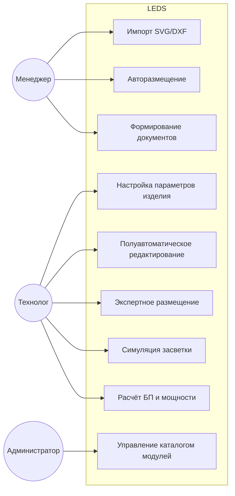
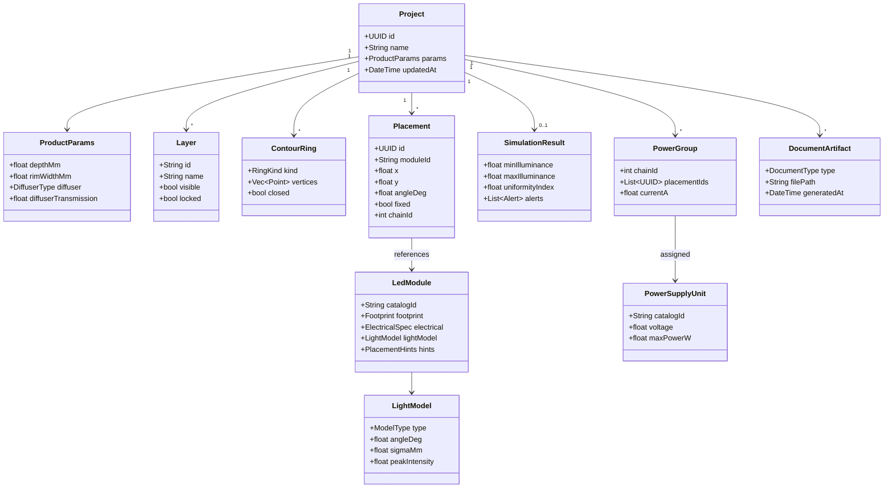
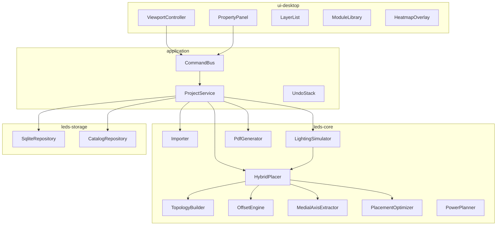
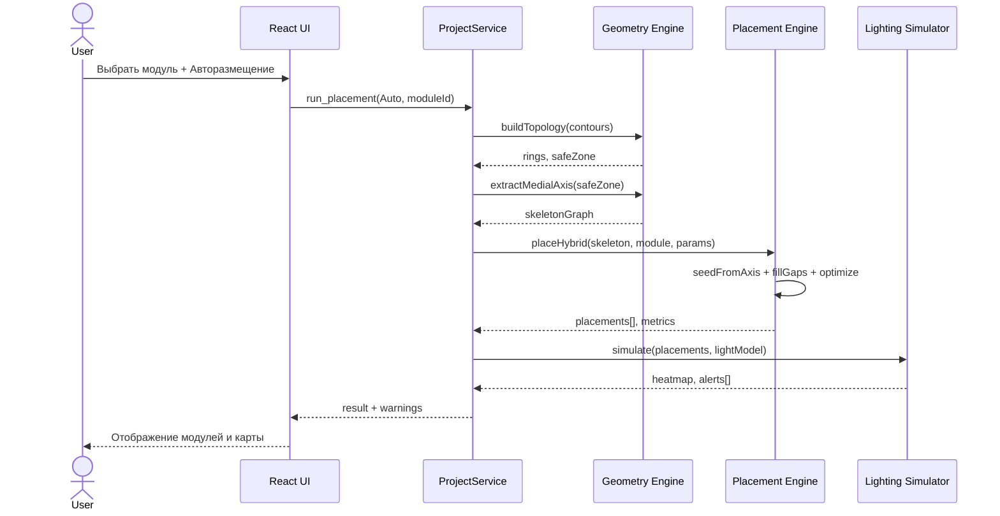
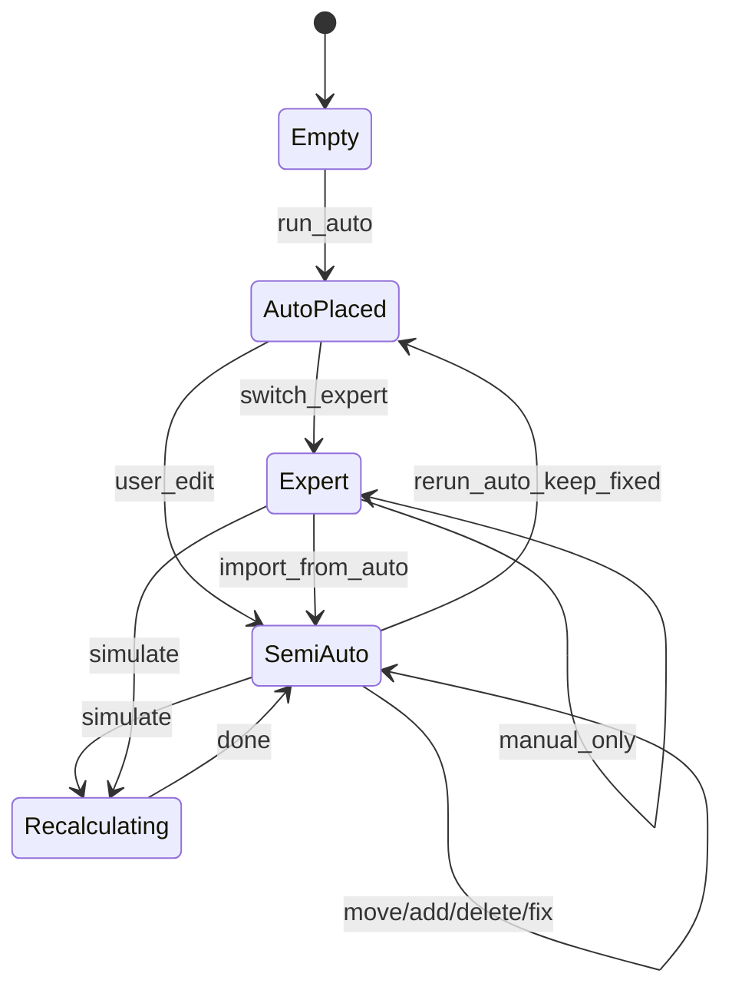
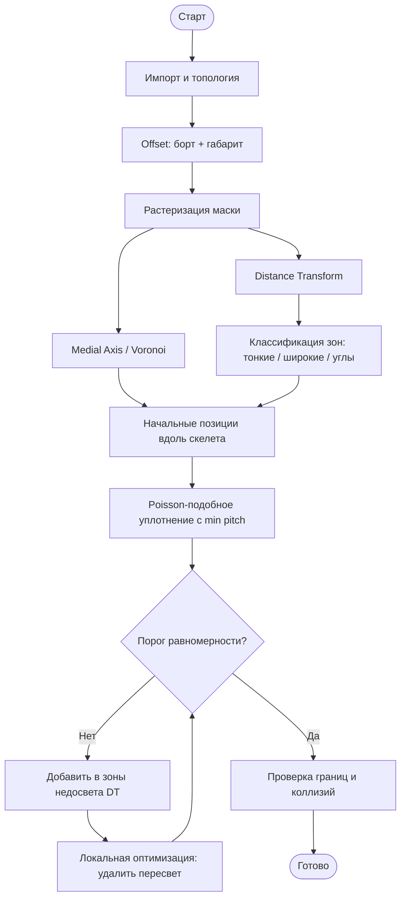
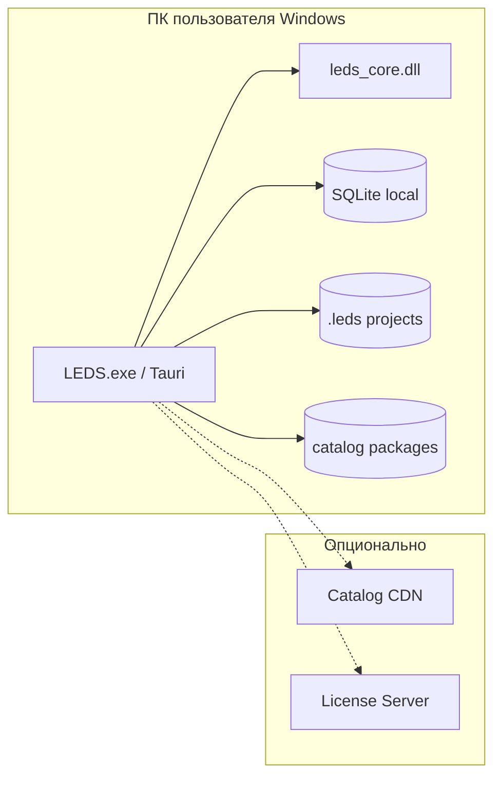
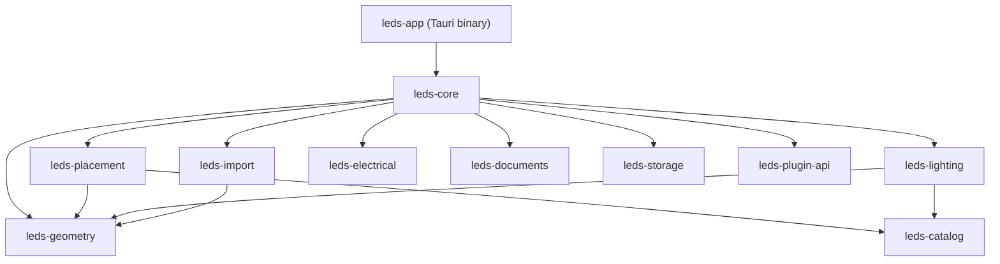

# UML-модель системы LEDS

Диаграммы в формате Mermaid (совместимы с GitHub, VS Code, Cursor).

---

## 1. Диаграмма вариантов использования

---

## 2. Диаграмма классов (доменная модель)

---

## 3. Диаграмма компонентов

---

## 4. Диаграмма последовательности — автоматическое размещение

---

## 5. Диаграмма состояний — режим размещения

---

## 6. Диаграмма активности — гибридный pipeline размещения

---

## 7. Диаграмма развёртывания

---

## 8. Пакетная диаграмма (Rust crates)

