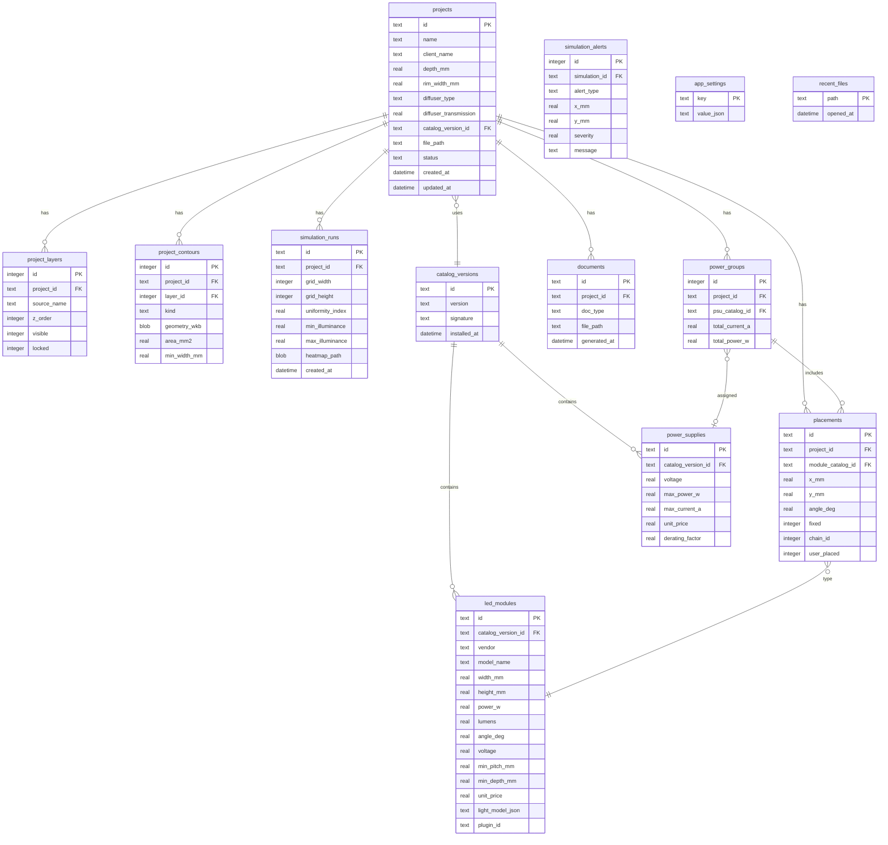

# Структура базы данных LEDS

Локальная **SQLite 3** для метаданных, истории проектов, настроек и кэша; тяжёлая геометрия — в файле `.leds` (FlatBuffers).

---

## 1. ER-диаграмма



---

## 2. DDL (основные таблицы)

```sql
-- Проекты
CREATE TABLE projects (
    id              TEXT PRIMARY KEY,
    name            TEXT NOT NULL,
    client_name     TEXT,
    depth_mm        REAL NOT NULL DEFAULT 80,
    rim_width_mm    REAL NOT NULL DEFAULT 15,
    diffuser_type   TEXT NOT NULL DEFAULT 'opal_3mm',
    diffuser_transmission REAL NOT NULL DEFAULT 0.65,
    catalog_version_id TEXT REFERENCES catalog_versions(id),
    file_path       TEXT,
    status          TEXT NOT NULL DEFAULT 'draft',
    created_at      TEXT NOT NULL,
    updated_at      TEXT NOT NULL
);

-- Слои
CREATE TABLE project_layers (
    id              INTEGER PRIMARY KEY AUTOINCREMENT,
    project_id      TEXT NOT NULL REFERENCES projects(id) ON DELETE CASCADE,
    source_name     TEXT NOT NULL,
    z_order         INTEGER NOT NULL,
    visible         INTEGER NOT NULL DEFAULT 1,
    locked          INTEGER NOT NULL DEFAULT 0
);

-- Контуры (геометрия — WKB или ссылка на blob в .leds)
CREATE TABLE project_contours (
    id              INTEGER PRIMARY KEY AUTOINCREMENT,
    project_id      TEXT NOT NULL REFERENCES projects(id) ON DELETE CASCADE,
    layer_id        INTEGER REFERENCES project_layers(id),
    kind            TEXT NOT NULL CHECK (kind IN ('outer', 'hole', 'island')),
    geometry_wkb    BLOB,
    area_mm2        REAL,
    min_width_mm    REAL
);

CREATE INDEX idx_contours_project ON project_contours(project_id);

-- Размещение модулей
CREATE TABLE placements (
    id              TEXT PRIMARY KEY,
    project_id      TEXT NOT NULL REFERENCES projects(id) ON DELETE CASCADE,
    module_catalog_id TEXT NOT NULL,
    x_mm            REAL NOT NULL,
    y_mm            REAL NOT NULL,
    angle_deg       REAL NOT NULL DEFAULT 0,
    fixed           INTEGER NOT NULL DEFAULT 0,
    chain_id        INTEGER,
    user_placed     INTEGER NOT NULL DEFAULT 0
);

CREATE INDEX idx_placements_project ON placements(project_id);

-- Симуляции
CREATE TABLE simulation_runs (
    id              TEXT PRIMARY KEY,
    project_id      TEXT NOT NULL REFERENCES projects(id) ON DELETE CASCADE,
    grid_width      INTEGER NOT NULL,
    grid_height      INTEGER NOT NULL,
    uniformity_index REAL,
    min_illuminance REAL,
    max_illuminance REAL,
    heatmap_path    TEXT,
    created_at      TEXT NOT NULL
);

CREATE TABLE simulation_alerts (
    id              INTEGER PRIMARY KEY AUTOINCREMENT,
    simulation_id   TEXT NOT NULL REFERENCES simulation_runs(id) ON DELETE CASCADE,
    alert_type      TEXT NOT NULL,
    x_mm            REAL,
    y_mm            REAL,
    severity        REAL NOT NULL,
    message         TEXT NOT NULL
);

-- Электрика
CREATE TABLE power_groups (
    id              INTEGER PRIMARY KEY AUTOINCREMENT,
    project_id      TEXT NOT NULL REFERENCES projects(id) ON DELETE CASCADE,
    psu_catalog_id  TEXT REFERENCES power_supplies(id),
    total_current_a REAL,
    total_power_w   REAL
);

-- Справочники
CREATE TABLE catalog_versions (
    id              TEXT PRIMARY KEY,
    version         TEXT NOT NULL,
    signature       TEXT,
    installed_at    TEXT NOT NULL
);

CREATE TABLE led_modules (
    id              TEXT NOT NULL,
    catalog_version_id TEXT NOT NULL REFERENCES catalog_versions(id),
    vendor          TEXT,
    model_name      TEXT NOT NULL,
    width_mm        REAL NOT NULL,
    height_mm       REAL NOT NULL,
    power_w         REAL NOT NULL,
    lumens          REAL NOT NULL,
    angle_deg       REAL NOT NULL,
    voltage         REAL NOT NULL,
    min_pitch_mm    REAL NOT NULL,
    min_depth_mm    REAL NOT NULL,
    unit_price      REAL,
    light_model_json TEXT NOT NULL,
    plugin_id       TEXT,
    PRIMARY KEY (id, catalog_version_id)
);

CREATE TABLE power_supplies (
    id              TEXT NOT NULL,
    catalog_version_id TEXT NOT NULL REFERENCES catalog_versions(id),
    voltage         REAL NOT NULL,
    max_power_w     REAL NOT NULL,
    max_current_a   REAL NOT NULL,
    unit_price      REAL,
    derating_factor REAL NOT NULL DEFAULT 0.8,
    PRIMARY KEY (id, catalog_version_id)
);

-- Документы
CREATE TABLE documents (
    id              TEXT PRIMARY KEY,
    project_id      TEXT NOT NULL REFERENCES projects(id) ON DELETE CASCADE,
    doc_type        TEXT NOT NULL,
    file_path       TEXT NOT NULL,
    generated_at    TEXT NOT NULL
);

-- Настройки приложения
CREATE TABLE app_settings (
    key             TEXT PRIMARY KEY,
    value_json      TEXT NOT NULL
);

CREATE TABLE recent_files (
    path            TEXT PRIMARY KEY,
    opened_at       TEXT NOT NULL
);
```

---

## 3. Индексы и миграции

- Версионирование схемы: `schema_migrations (version, applied_at)`.
- Миграции — SQL-файлы `migrations/00N_description.sql`.
- При открытии `.leds` — синхронизация SQLite ↔ ZIP (источник истины — файл проекта).

---

## 4. Кэш и производительность

| Данные | Хранение |
|--------|----------|
| Distance field | Временный файл / память, не в SQLite |
| Medial axis | Кэш в `project.json` optional debug |
| Heatmap PNG | `simulation_runs.heatmap_path` |
| Импорт hash | `projects` + dedup повторного импорта |

---

## 5. Резервное копирование

- Пользователь копирует `.leds` + папку `Documents/LEDS`.
- Опционально: экспорт «архив проекта» (zip всего связанного).
