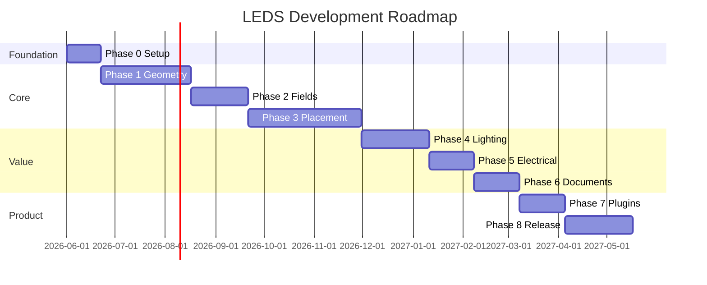

# План разработки LEDS по этапам

**Общая оценка:** 9–14 месяцев до production-ready v1.0 (команда 3–4 FTE).  
**Подход:** вертикальные срезы с golden tests на каждом этапе.

---

## Фаза 0 — Подготовка (2–3 недели)

| Задача | Результат |
|--------|-----------|
| Инициализация monorepo (Cargo workspace + Tauri + React) | Скелет сборки |
| CI: test, lint, fmt | Зелёный pipeline |
| Схема `.leds` + SQLite migrations v1 | Контракт данных |
| Эталонные SVG от технолога | `tests/golden/` — **отложено**, синтетические макеты на Фазе 0 |
| Каталог 5–10 реальных модулей | `catalog/modules/` |

**Критерий выхода:** `leds-cli import letter_O.svg` → JSON контуров.

---

## Фаза 1 — Геометрия (6–8 недель) · Сложность: **9/10**

| # | Модуль | Deliverable |
|---|--------|-------------|
| 1.1 | SVG import (path, transform) | Замкнутые контуры |
| 1.2 | DXF LWPOLYLINE, ARC, CIRCLE | Базовый DXF |
| 1.3 | Topology (outer/holes) | Дерево вложенности |
| 1.4 | Polygon offset (Clipper2) | Safe zone с бортом |
| 1.5 | Feature: min width, sharp angles | Метаданные для placement |
| 1.6 | UI: viewport, pan/zoom, слои | Просмотр без размещения |

**Критерий:** буква «О» с отверстием; offset визуализируется; DXF из Corel открывается.

---

## Фаза 2 — Скелет и поля (4–5 недель) · Сложность: **8/10**

| # | Модуль | Deliverable |
|---|--------|-------------|
| 2.1 | Raster mask + Distance Transform | Поле расстояний |
| 2.2 | Medial axis (segment Voronoi или thinning) | Skeleton graph |
| 2.3 | Zone classification | thin / wide / corner |
| 2.4 | Debug overlay в UI | MAT + DT heat |

**Критерий:** скелет тонкой буквы «I» — одна ветка; у «B» — ветвления.

---

## Фаза 3 — Размещение v1 (8–10 недель) · Сложность: **10/10**

| # | Модуль | Deliverable |
|---|--------|-------------|
| 3.1 | Hybrid placer (см. doc 08) | Auto mode |
| 3.2 | Collision + boundary validation | 0 выходов за зону |
| 3.3 | Local optimizer (remove/fill) | Uniformity ≥ порог |
| 3.4 | SemiAuto: fixed, move, add, delete | Режим 2 |
| 3.5 | Expert manual + snap | Режим 3 |
| 3.6 | Undo/redo | 50 шагов |

**Критерий:** golden tests: mean error < 15% vs эталон технолога; < 3 с на букву 500 мм.

---

## Фаза 4 — Светотехника (5–6 недель) · Сложность: **7/10**

| # | Модуль | Deliverable |
|---|--------|-------------|
| 4.1 | Light spot models (Gaussian+cos) | Per module |
| 4.2 | Superposition heatmap | Overlay UI |
| 4.3 | Alerts: under/over/hotspot | Список + маркеры |
| 4.4 | Depth/diffuser attenuation | v1.1 калибровка |
| 4.5 | Lumens, power totals | Панель свойств |

**Критерий:** карта коррелирует с ручной оценкой технолога на 3 макетах.

---

## Фаза 5 — Электрика и стоимость (3–4 недели) · Сложность: **5/10**

| # | Модуль | Deliverable |
|---|--------|-------------|
| 5.1 | Chain builder | Группы модулей |
| 5.2 | PSU selection | BOM БП |
| 5.3 | Cost estimator | Себестоимость |
| 5.4 | Wiring diagram (2D) | PDF + UI |

---

## Фаза 6 — Документы (4 недели) · Сложность: **6/10**

| # | Документ |
|---|----------|
| 6.1 | Техническое задание PDF |
| 6.2 | Спецификация материалов |
| 6.3 | Расчёт мощности |
| 6.4 | Схема подключения |
| 6.5 | Коммерческое предложение |
| 6.6 | Схема монтажа |

---

## Фаза 7 — Плагины и каталоги (3–4 недели) · Сложность: **6/10**

| # | Модуль |
|---|--------|
| 7.1 | Catalog package format + signature |
| 7.2 | In-app updater |
| 7.3 | Plugin manifest validation |
| 7.4 | WASM host (optional v1.1) |

---

## Фаза 8 — Hardening & Release (4–6 недель) · Сложность: **7/10**

- Полевые тесты на 20+ реальных макетах  
- Performance profiling  
- Installer, code signing  
- Документация пользователя  
- Beta → RC → v1.0  

---

## Дорожная карта (Gantt, упрощённо)



---

## Оценка сложности модулей (1–10)

| Модуль | Сложность | Риск | Комментарий |
|--------|-----------|------|-------------|
| SVG import | 6 | Средний | Transform, единицы |
| DXF import | 7 | Высокий | SPLINE, битые полилинии |
| Topology / holes | 8 | Высокий | Критично для букв |
| Polygon offset | 7 | Средний | Clipper2 зрелый |
| Distance transform | 5 | Низкий | Классика |
| Medial axis | 9 | Высокий | Ядро интеллекта |
| Hybrid placement | 10 | Очень высокий | Главная ценность продукта |
| Lighting sim | 7 | Средний | Нужна калибровка |
| Electrical | 5 | Низкий | Правила + справочник |
| PDF docs | 6 | Низкий | Шаблоны |
| UI viewport | 7 | Средний | CAD UX |
| Plugin system | 6 | Средний | Можно упростить v1 |
| Licensing/updates | 4 | Низкий | Отложить |

---

## Параллелизация работ

```
        Phase 1 ─────────────────►
              Phase 2 ────────►
                    Phase 3 ──────────────►
        UI shell (Phase 0–1) ─────────────────────────►
                              Phase 4 ──────►
                                    Phase 5–6 ──►
```

Frontend viewport и панели начинаются с Фазы 0; активная интеграция с ядром — с Фазы 3.

---

## MVP vs v1.0

**MVP (внутренний, ~4 мес):** SVG + топология + auto placement без DXF + базовая heatmap + PDF ТЗ.  
**v1.0 (коммерческий):** полный scope ТЗ, три режима, DXF, документы, каталоги, приемлемая точность на декоративных шрифтах.

**Не начинать реализацию** с UI-оболочки без геометрии — риск «красивого прототипа» без ценности.
